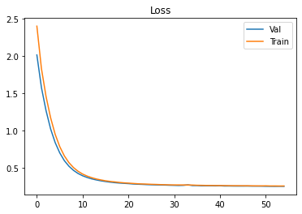
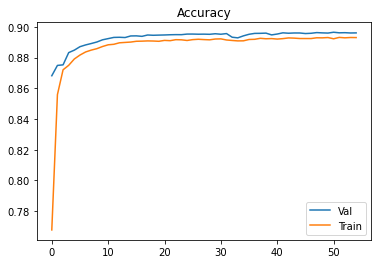
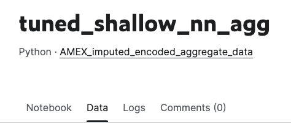
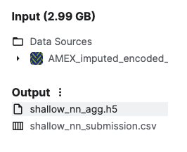

# American Express Default Prediction - Kaggle Competition

In this project we develop a machine learning model that predicts credit defaults using real-world data from American Express to better manage risk in a consumer lending business. These models aim to provide a high-scoring solution to the Kaggle competition posted by American Express - [American Express Default Prediction](https://www.kaggle.com/c/amex-default-prediction). 

This repository holds and organizes our notebooks downloaded from Kaggle. The full list of links to each notebook is listed in the [Usage](#usage) section of this readme. Instructions on how to run the notebooks yourself are also included. 

Our report for our project will be listed in the [Project Report](#project-report) section, but a brief outline of our project and code is as follows: 

1. Collect, impute, encode, and preprocess the [compressed feather data](https://www.kaggle.com/datasets/munumbutt/amexfeather) and [aggregate data](https://www.kaggle.com/datasets/huseyincot/amex-agg-data-pickle) found from other competititors. 

    * Compressed Feather Data
        * [amex_generate_features](https://www.kaggle.com/code/ethansilvas/amex-generate-features)
        * [amex_generate_features_test](https://www.kaggle.com/ethansilvas/amex-generate-features-test)
    * Aggregate Data
        * [amex_impute_encode_agg_data](https://www.kaggle.com/ethansilvas/amex-impute-encode-agg-data)
2. Develop baseline models to see performance without much hyperparameter tuning or validation sets
    * All models in [Baseline Models](./Baseline_Models/) folder for training and predicting with the compressed and aggregate data sets
    * Examples: 
        * Logistic Regression - [baseline_logistic_regression_agg](https://www.kaggle.com/code/ethansilvas/baseline-logistic-regression-agg)
        * Shallow Neural Network - [baseline_shallow_nn_agg](https://www.kaggle.com/code/ethansilvas/baseline-shallow-nn)
3. Tune the best performing models using validation, hyperparameters, hidden layers, etc. to maximize M score
    * All models in [Tuned Models](./Tuned_Models/) folder for training and predicting with the aggregate data only, since we found that the aggregate data performed better for all models. 
    * Examples: 
        * Deep Neural Network - [tuned_DNN_agg](https://www.kaggle.com/ethansilvas/tuned-dnn-agg)
        * LGBM + SKFold - * [tuned_lgbm_skfold](https://www.kaggle.com/code/ethansilvas/tuned-lgbm-skfold)

---

## Project Report 

### Competition Description

This is a binary classification problem where our objective is to predict the probability that a customer does not pay back their credit card balance amount in the future based on their monthly customer profile. We are required to develop a model that generates predictions on the provided test set data and submit the predictions in a .csv file that is scored using the competition's evaluation metric `M` which is defined as: 

`The evaluation metric, 𝑀, for this competition is the mean of two measures of rank ordering: Normalized Gini Coefficient, 𝐺, and default rate captured at 4%, 𝐷.`

The highest possible score of `M` is a 1.0 and the top leaderboard score is 0.80977. 

### Project Goals 

In developing a solution for this competition we hope to: 
* Impute and encode our own dataset
* Use new models like XGBoost and LGBM
* Test techniques like dropout and regularization for neural networks 
* Score as close to 0.80 as possible

### Process

1. Data collection

    * Impute NaN values and one-hot encode the [compressed feather data](https://www.kaggle.com/datasets/munumbutt/amexfeather) and [aggregate data](https://www.kaggle.com/datasets/huseyincot/amex-agg-data-pickle)
2. Develop baseline models
    * LGBM
    * XGBoost
    * Scikit-learn models
        * LogisticRegression
        * DecisionTreeClassifier
        * RandomForestClassifier
        * SVC
        * KNN Classifier
    * Shallow neural network (1 hidden layer)
3. Tune models
    * Different hyperparameters specific to each model 
    * More hidden layers and different activation functions

### Data Collection 

The [original dataset](https://www.kaggle.com/competitions/amex-default-prediction/data?select=train_data.csv) posted by American Express had a few things to get around:  

* The training and testing sets were 16 and 33GB each 
* The columns, or features were hidden and grouped up to protect user privacy as so: 
    * D_* = Delinquency variables
    * S_* = Spend variables
    * P_* = Payment variables
    * B_* = Balance variables
    * R_* = Risk variables
* There were lots of NaN values and there were too many to be dropped from the dataset. 
* The data was already normalized 

Thankfully, other people in the competition came up with two datasets that we used in developing our models: 

* [The compressed feather data](https://www.kaggle.com/datasets/munumbutt/amexfeather)
* [The aggregate data](https://www.kaggle.com/datasets/huseyincot/amex-agg-data-pickle)

However, these datasets did not impute the NaN values or encode the categorical features, so we decided to create imputed and one-hot encoded versions of these datasets. We decided to impute the NaN valuse by replacing numerical columns with the mean for the column and categorical values with the most common value. We also opted to one-hot encode all of the categorical values. The code for this can be seen in our notebooks:

* Feather Data
    * [amex_generate_features](https://www.kaggle.com/code/ethansilvas/amex-generate-features)
    * [amex_generate_features_test](https://www.kaggle.com/ethansilvas/amex-generate-features-test)
* Aggregate Data 
    * [amex_impute_encode_agg_data](https://www.kaggle.com/ethansilvas/amex-impute-encode-agg-data)

Even with the compressed sized of these datasets, our TensorFlow models had trouble fitting so we followed the TensorFlow guides to building data pipelines: [Load a pandas DataFrame](https://www.tensorflow.org/tutorials/load_data/pandas_dataframe#full_example) and [Using tf.data with tf.keras](https://www.tensorflow.org/guide/data#using_tfdata_with_tfkeras). For our data, essentially all we needed to do was convert our columns to TensorFlow Input() objects and cast the datatypes into float32. This code can be seen at the beginning of each of our neural network files, ex: [baseline_shallow_nn_agg](https://www.kaggle.com/code/ethansilvas/baseline-shallow-nn)

## Baseline Models

Our goal with the baseline models was to try as many machine learning models as we could to see which ones performed well with the problem so that we could then take the best performing ones and tune them to maximize our competition score. We tried to keep these baseline models as simple as possible which meant we didn't really experiment with different hyperparameters and did not introduce validation sets. Since this is a binary classification problem, we mainly focused on using classifier models and tried many different kinds from scikit-learn, XGBoost, LGBM, and with tensorflow neural networks. 

In our files, you will notice that a lot of models have two different versions: a normal version and an "aggregate" version. As metioned in the [Data Collection](#data-collection) section, at this time in our project we were testing with two different datasets. 

### Scikit-learn models

Since scikit-learn models are so easy to swap out with each other, we decided to do lots of experimenting with different models to see which ones would perform well. Aside from the decision tree classifier, which overfit to the training set, most models performed well and generated over a 0.70 M score when submitting to the competition. We were very surprised at how well these models were performing considering that for the most part we did not use any hyperparameters and left the models in their default state ex: `model = LogisticRegression()`. Some models like the KNN classifier and the SGD classifier either didn't perform as well as the others or took so long to train that it wasn't worth their performance. The only real anomoly with these models was the surprisingly low F1 score for 1 (credit default) for the random forest classifier. Other than that, the other models performed around the same while hovering around 90% accuracy on the training set. 

### TensorFlow Neural Network 

For our baseline neural network we wanted to use a shallow neural network, meaning only one hidden layer, to get an idea of how we should add layers or nodes per layer when we decide to tune the model. This model performed extremely well considering that it only had one hidden layer with 116 nodes, a ReLU activation function, and adam optimizer. It got a submission score of 0.78462 which even now competes with most of our tuned models! Knowing what we know now, this performance is likely due to it having a 90% accuracy which we found to be the "sweetspot" for high performing models, as well as a top F1-score for 1 at 0.82. This model performed so well that we even decided to tune a shallow neural network and a deep neural network. 

Graphs: 

 

### XGBoost and LGBM

We had seen from the Kaggle competition discussion that many competitors made use of XGBoost and LGBM models so we decided to try them as well. One thing to note is that many people used these models because they can handle NaN values in the data by themselves, but we wanted to see what they could do with our imputed and encoded data. These performed very well and produced submission scores above 0.77. We even tried using the XGB regressor, despite this being a classification problem, and it still did well with a submission score of 0.76512. From the XGB training M scores we could see that they might have overfit which wouldn't be too unrealistic since we did not use any hyperparameters. However, something surprising was that even despite having training accuracy above 90%, each of these models still provided great submission scores, so they couldn't have overfit that much. 

### Scores

| Model                    | Train F1-Score 0 | Train F1-Score 1 | Train Accuracy | Train M Score | Test M Score |
|--------------------------|------------------|------------------|----------------|---------------|--------------|
| Decision Tree Classifier | 1.0              | 1.0              | 100%           | 1.0           | 0.34586      |
| Logistic Regression      | 0.93             | 0.80             | 90%            | 0.77471       | 0.77498      |
| Random Forest Classifier | 0.91             | 0.69             | 86%            | 0.63409       | 0.71774      |
| KNN Classifier           | 0.95             | 0.83             | 92%            | 0.70400       |              |
| SGD Classifier           | 0.93             | 0.76             | 89%            | 0.74047       | 0.73017      |
| Shallow Neural Network   | 0.93             | 0.82             | 90%            | 0.79305       | 0.78462      |
| LGBM Classifier          | 0.94             | 0.82             | 91%            | 0.58849       | 0.78137      |
| XGB Classifier           | 0.95             | 0.85             | 92%            | 0.85171       | 0.77002      |
| XGB Regressor            | 0.94             | 0.84             | 92%            | 0.83929       | 0.76512      |

**Note: these results are the best performing training results, and are all from using the aggregate data set.**

## Tuned Models and Results 

For our tuned models we chose the models that performed the best and had reasonable training times (maximum of 2 hours). This is where we started to implement validation sets instead of just training and then submitting the model. We tried our best to experiment with as many hyperparameter options as we could, but the scikit-learn models seemed to have the best performance with few hyperparameter tunings. Two of our tuned models we used with a new strategy of StratifiedKFolding to see how they would perform. StratifiedKFolding was chosen because the dataset is decently imbalanced. 

### Scikit-learn models

These models only required a few hyperparameter changes to increase the performance, so tuning them was more about finding the best validation split percentage. A validation split of 25% ended up working best for both the logistic regression model and the random forest classifier. Tuning the random forest classifier was much harder as certain hyperparameters would result in either terrible performance or extremely long training times. This was our first clue that if we had more time we might try using something like RandomizedSearchCV() to automatically find the optimal hyperparameters for these kinds of models. Overall, the tuned logistic regression model was only slightly improved and it definitely felt as though the model had reached its limit in terms of performance, and the random forest classifier improved greatly from our baseline model but in the end did not produce great submission scores compared to other models. 

### TensorFlow Shallow and Deep Neural Networks

As mentioned in the baseline section, our shallow neural network performed very well and since we found that adding more complexity to our model didn't increase performance we decided to tune a shallow and deep neural network to see the best performances we could get with tunings. Unfortunately, we could not find any combination of hyperparameters that would result in higher performance than our baseline shallow neural network. We tried using dropout, regularization, different numbers of layers and nodes, and training for different numbers of epochs but nothing seemed to give us better performance. We did notice that dropout specifically would greatly help in stopping our model from overfitting but at the cost of the model never reaching 90% accuracy on the validation set as all of our other models did. If we had more time we would continue testing different hyperparameters but for now our baseline model performed the best. 

Shallow Graphs: 

 

Deep Graphs

 

### Implementing StratifiedKFold

Since our models had seemed to max out at around 0.78 submission score we decided to check out the community discussion to see if we could use any other strategies that we had not used. We found that people were using StratifiedKFold() splitting to reduce the impact of the class imbalance in the dataset. We first tried using it with our simpler tuned logistic regression model and it only very slightly increased performance. However, we had seen a few people use StratifiedKFold with LGBM so we tried this as well (still with our imputed and encoded data). Luckily this greatly improved performance and got our submission score up to 0.79185! This model had a lot more hyperparameters we could tune but the most important ones seemed to be n_estimators, num_leaves, learning_rate, and reg_alpha. Since there were different models per fold, we noticed that his also seemed to help with overfitting since the loss curves for each fold were consistent and not jumping around like we had seen with other models.

### Scores

| Model                        | Validation F1-Score 0 | Validation F1-Score 1 | Validation Accuracy | Validation M Score | Test M Score |
|------------------------------|-----------------------|-----------------------|---------------------|--------------------|--------------|
| Logistic Regression          | 0.93                  | 0.80                  | 90%                 | 0.78446            | 0.77868      |
| Random Forest Classifier     | 0.93                  | 0.80                  | 89%                 | 0.76154            | 0.75896      |
| XGB Regressor                | 0.95                  | 0.86                  | 93%                 | 0.86363            | 0.75381      |
| Shallow Neural Network       | NA                    | NA                    | 89%                 | NA                 | 0.76586      |
| Deep Neural Network          | NA                    | NA                    | 90%                 | NA                 | 0.78412      |
| Logistic Regression + SKFold | 0.93                  | 0.80                  | 90%                 | 0.77890            | 0.77890      |
| LGBM + SKFold                | 0.94                  | 0.81                  | 90%                 | 0.79200            | 0.79185      |

---

## Technologies

Kaggle handles all code dependencies and we do not advise trying to run our notebooks on your own machine because of high memory usage. 

The following dependencies are used: 
1. [Pandas](https://github.com/pandas-dev/pandas) (1.3.5) - Data analysis
2. [Matplotlib](https://github.com/matplotlib/matplotlib) (3.5.1) - Data visualization
3. [Numpy](https://numpy.org/) (1.21.5) - Data calculations + Pandas support
4. [PyArrow](https://arrow.apache.org/docs/python/index.html) (11.0.0) - Working with .ftr files
5. [TensorFlow](https://www.tensorflow.org/) (2.0.0+) - Deep neural network creation
6. [Keras](https://keras.io/about/) - Deep neural network creation
7. [Scikit-Learn](https://scikit-learn.org/stable/index.html) (1.1.3) - Machine learning tools and methods
8. [XGBoost](https://xgboost.readthedocs.io/en/stable/) (1.7.0) - Classification machine learning model
9. [LightGBM](https://lightgbm.readthedocs.io/en/v3.3.2/) (3.3.2) - Classification machine learning model

---

## Usage

To run our Kaggle notebooks you will need to: 

1. Sign in with your Kaggle account
2. Go to the notebook and click the "Copy & Edit" button at the top right  
    
3. Accept the Kaggle competition rules when prompted
4. Then you can either click the "Run All" button to run the file in the editor, or you can click the "Save Version" button that will give you the option to do a "Save and Run All (Commit)" which lets you run that version of the notebook in the background. Doing the save and run all option will likely be better since many of our notebooks take 30+ minutes to run in full. 

    
    

5. (Optional) If you would like to use one of our models in your own code, all models except for our SKFold models are downloadable in the "Data" section of each notebook:

    

    The downloadable model will be in the "Output" folder typically listed as `model_name.sav` or `model_name.h5` for neural network models:

    

6. (Optional) If you would like to verify model performance, you can download the `model_name_submission.csv` file, also located in the "Output" folder, and submit it using the "Late Submission" button on the [competition main page](https://www.kaggle.com/c/amex-default-prediction). 

### Kaggle Links 

Note: Some files are split due to memory constraints.

* Data Collection
    * Feather Data
        * [amex_generate_features](https://www.kaggle.com/code/ethansilvas/amex-generate-features)
        * [amex_generate_features_test](https://www.kaggle.com/ethansilvas/amex-generate-features-test)
    * Aggregate Data 
        * [amex_impute_encode_agg_data](https://www.kaggle.com/ethansilvas/amex-impute-encode-agg-data)
* Baseline Models
    * Decision Tree Classifier 
        * [train_decision_tree_classifier](https://www.kaggle.com/code/ethansilvas/train-decision-tree-classifier)
        * [predict_decision_tree_classifier](https://www.kaggle.com/code/ethansilvas/predict-decision-tree-classifier)
    * Logistic Regression
        * [baseline_logistic_regression](https://www.kaggle.com/code/ethansilvas/baseline-logistic-regression)
    * Logistic Regression Aggregate 
        * [baseline_logistic_regression_agg](https://www.kaggle.com/code/ethansilvas/baseline-logistic-regression-agg)
    * Random Forest Classifier
        * [baseline_random_forest_classifier](https://www.kaggle.com/code/ethansilvas/baseline-random-forest-classifier)
    * Random Forest Classifier Aggregate
        * [baseline_random_forest_classifier_agg](https://www.kaggle.com/code/ethansilvas/baseline-random-forest-classifier-agg)
    * KNN Classifier
        * [knnclassifier-agg-data](https://www.kaggle.com/code/karimbouzina/knnclassifier-agg-data)
    * LGBM Classifier
        * [lgbm-ftr-data](https://www.kaggle.com/code/karimbouzina/lgbm-ftr-data)
    * LGBM Classifier Aggregate
        * [lgbm-with-agg-data](https://www.kaggle.com/code/karimbouzina/lgbm-with-agg-data)
    * Shallow Neural Network 
        * [baseline_shallow_nn_agg](https://www.kaggle.com/code/ethansilvas/baseline-shallow-nn)
    * Shallow Neural Network Aggregate
        * [baseline_shallow_nn_agg](https://www.kaggle.com/code/ethansilvas/baseline-shallow-nn-agg)
    * SGD Classifier
        * [sgd-agg](https://www.kaggle.com/code/jeffreycrabill/sgd-agg)
    * XGB Classifier Aggregate
        * [xgb-classifier-agg](https://www.kaggle.com/naomyvelasco/xgb-classification-baseline)
    * XGB Classifier
        * [xgb-classifier-feather](https://www.kaggle.com/code/naomyvelasco/xgb-classifier-feather)
* Tuned Models 
    * Logistic Regression
        * [tuned_logistic_regression_agg](https://www.kaggle.com/code/ethansilvas/tuned-logistic-regression-agg)
    * Random Forest Classifier
        * [tuned_random_forest_classifier_agg](https://www.kaggle.com/code/ethansilvas/tuned-random-forest-classifier-agg)
    * Shallow Neural Network
        * [tuned_shallow_nn_agg](https://www.kaggle.com/ethansilvas/tuned-shallow-nn-agg)
    * Deep Neural Network
        * [tuned_DNN_agg](https://www.kaggle.com/ethansilvas/tuned-dnn-agg)
    * Logistic Regression + StratifiedKFold
        * [tuned_logistic_regression_skfold](https://www.kaggle.com/code/ethansilvas/tuned-logistic-regression-skfold/settings)
    * LGBM Classifier + StratifiedKFold
        * [tuned_lgbm_skfold](https://www.kaggle.com/code/ethansilvas/tuned-lgbm-skfold)
    

### Other Files 

Our presentation slides for this project are in the Resources folder: 

---

## Contributors

[Ethan Silvas](https://github.com/ethansilvas)  
[Naomy Velasco](https://github.com/naomynaomy)  
[Karim Bouzina](https://github.com/karim985)  
[Jeff Crabill](https://github.com/jeffreycrabill)  

---

## License

This project uses the [GNU General Public License](https://choosealicense.com/licenses/gpl-3.0/)